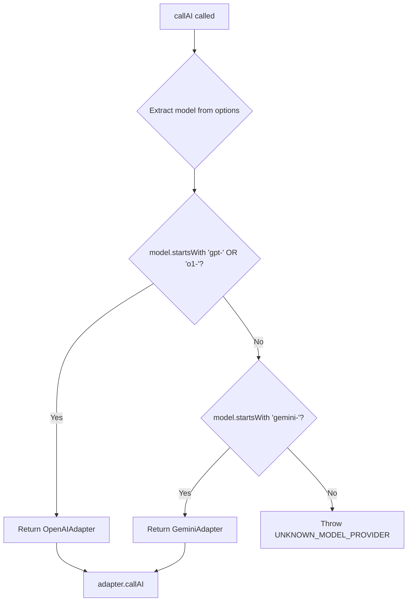

# AI Provider Router Architecture

**Date:** 2026-01-27
**Type:** Architectural Refactor
**Layer:** Infrastructure (Ports & Adapters)

---

## 1. Overview

The `AIProviderRouter` is an infrastructure component that routes AI calls to the correct provider adapter based on the requested model name. It implements the `IAIProvider` port interface and acts as a transparent proxy between the application layer and multiple AI provider adapters.

**Purpose:** Enable multi-provider AI support (Gemini + OpenAI) within a single injection point, maintaining hexagonal architecture principles.

**High-level responsibility:** Determine at runtime which adapter (GeminiAdapter or OpenAIAdapter) should handle an AI request based on the model name prefix.

---

## 2. Problem Statement

### Before Refactor

The system used a single `GeminiAdapter` instance injected at startup:

```javascript
// server.js (BEFORE)
const aiProvider = new GeminiAdapter();
```

This caused a critical bug in multi-model pipelines:

1. `ModelSelectionPolicy` correctly returned `gpt-4o-mini` for `json_conversion` function type
2. The model name was passed to `GeminiAdapter.callAI()`
3. `GeminiAdapter` attempted to use `gpt-4o-mini` with Google's Gemini SDK
4. Result: 404 error from Google's API

### After Refactor

```javascript
// server.js (AFTER)
const aiProvider = new AIProviderRouter();
```

The router inspects each request's model name and delegates to the appropriate adapter.

---

## 3. Component Structure

```
infrastructure/ai/
├── AIProviderRouter.js      # NEW: Routes to correct adapter
├── gemini/
│   ├── GeminiAdapter.js     # Handles gemini-* models
│   └── GeminiConfig.js
└── openai/
    ├── OpenAIAdapter.js     # Handles gpt-* and o1-* models
    └── OpenAIConfig.js
```

---

## 4. Routing Logic

The router uses model name prefixes to determine the target adapter:

| Model Prefix | Target Adapter | Example Models |
|--------------|----------------|----------------|
| `gpt-` | OpenAIAdapter | `gpt-4o-mini`, `gpt-4-turbo` |
| `o1-` | OpenAIAdapter | `o1-preview`, `o1-mini` |
| `gemini-` | GeminiAdapter | `gemini-2.5-flash`, `gemini-2.5-pro` |
| (other) | Error | Fail-fast with `UNKNOWN_MODEL_PROVIDER` |

### Routing Decision Flow



---

## 5. Interface Contract

`AIProviderRouter` implements `IAIProvider`:

```javascript
class AIProviderRouter extends IAIProvider {
  async callAI(userId, messages, options)
  async callAIWithFunctionType(userId, messages, functionType)
}
```

### callAI Signature

```javascript
/**
 * @param {string} userId - User identifier
 * @param {Array<{role: string, content: string}>} messages - Chat messages
 * @param {Object} options
 * @param {string} options.model - Model name (determines routing)
 * @param {number} options.temperature - Sampling temperature
 * @param {number} options.maxTokens - Maximum response tokens
 * @param {boolean} options.forceJson - Force JSON response format
 * @returns {Promise<{content, model, tokensUsed, energyConsumed}>}
 */
```

---

## 6. Execution Flow

### End-to-End Pipeline Example (Habit Series Creation)

```
1. CreateHabitSeriesUseCase
   ├── Pass 1: Creative (gemini-2.5-flash)
   │   └── AIProviderRouter.callAI({model: 'gemini-2.5-flash'})
   │       └── Routes to GeminiAdapter
   │
   ├── Pass 2: Structure (gemini-2.5-pro)
   │   └── AIProviderRouter.callAI({model: 'gemini-2.5-pro'})
   │       └── Routes to GeminiAdapter
   │
   └── Pass 3: JSON Schema (gpt-4o-mini)
       └── AIProviderRouter.callAI({model: 'gpt-4o-mini'})
           └── Routes to OpenAIAdapter  ← NOW WORKS CORRECTLY
```

---

## 7. Dependency Injection

The router is instantiated once in the composition root (`server.js`) and injected into all controllers that require AI capabilities:

```javascript
// server.js
const aiProvider = new AIProviderRouter();

setHabitSeriesDeps({
  userRepository,
  habitSeriesRepository,
  energyRepository,
  aiProvider,  // Router injected, not specific adapter
});
```

Controllers and use cases remain unaware of the routing mechanism. They interact with `IAIProvider` interface only.

---

## 8. Error Handling

### Fail-Fast on Unknown Models

```javascript
throw new Error(
  `UNKNOWN_MODEL_PROVIDER: No adapter configured for model "${model}". ` +
  `Expected prefix: 'gpt-', 'o1-', or 'gemini-'`
);
```

This prevents silent failures when:
- A new model is added to `ModelSelectionPolicy` without updating the router
- A typo in model name bypasses routing logic

### Adapter-Level Errors

Each adapter handles its own provider-specific errors:
- `GeminiAdapter`: Google API errors
- `OpenAIAdapter`: OpenAI API errors

These propagate unchanged through the router.

---

## 9. Observability

The router logs routing decisions:

```
🔀 [AIRouter] Routing to OpenAIAdapter for model: gpt-4o-mini
🔀 [AIRouter] Routing to GeminiAdapter for model: gemini-2.5-flash
```

Combined with adapter-level logs:
```
🤖 [OpenAI] Llamando modelo: gpt-4o-mini
✅ [OpenAI] Respuesta recibida - Tokens: 342, Energía: 0
```

---

## 10. Key Invariants

1. **Single Responsibility:** Router only routes; adapters handle provider-specific logic
2. **Interface Compliance:** Router implements `IAIProvider` exactly as adapters do
3. **Deterministic Routing:** Same model name always routes to same adapter
4. **No State:** Router is stateless; adapters are instantiated once and reused
5. **Fail-Fast:** Unknown models cause immediate, clear errors

---

## 11. Known Limitations and Accepted Debt

### Limitations

1. **Prefix-Based Routing:** Relies on model name conventions. Non-standard model names will fail.

2. **Static Adapter Set:** Adding a new provider (e.g., Claude) requires code changes to the router.

3. **No Dynamic Discovery:** Adapters are hardcoded, not loaded from configuration.

### Accepted Technical Debt

1. **callAIWithFunctionType:** Currently defaults to GeminiAdapter. This method is less commonly used and may need refinement if function-type-based routing across providers is required.

2. **No Adapter Health Checks:** Router does not verify adapter availability before routing.

---

## 12. Files Modified

| File | Change |
|------|--------|
| `infrastructure/ai/AIProviderRouter.js` | Created (new file) |
| `server.js` | Changed from `GeminiAdapter` to `AIProviderRouter` |

---

## 13. Testing Considerations

To verify the router works correctly:

1. **Unit Test:** Mock adapters and verify routing based on model prefix
2. **Integration Test:** Execute multi-model pipeline and verify correct API calls
3. **Negative Test:** Pass unknown model prefix and verify error thrown

---

## 14. Related Documentation

- [Habit Series Creation Flow](.docs/habit_series_creation_flow.md)
- [Technical Debt Registry](.docs/techni  cal-debt.md)
