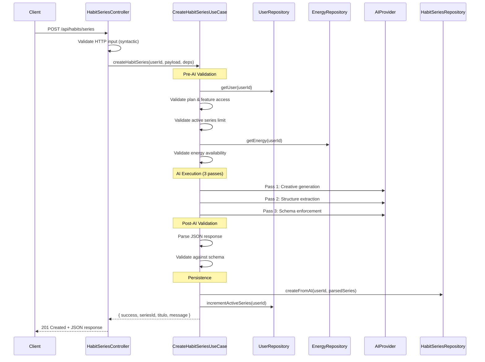

# Habit Series Architectural Coherence Refactor

**Date:** 2026-01-26
**Scope:** Closing architectural and contractual coherence for the Habit Series feature

---

## 1. Overview

This document describes the refactoring work performed to close architectural coherence gaps in the Habit Series creation flow. The refactor addressed:

1. Disconnected controller that validated but never created
2. Misaligned application contract with the use-case signature
3. Domain entities incorrectly placed in the application layer
4. Broken import paths throughout the codebase

The system now has a coherent flow from HTTP request to persistence.

---

## 2. Entry Point

**Endpoint:** `POST /api/habits/series`

**Authentication:** Firebase token required (via `authenticate` middleware)

**Request Body:**
```json
{
  "language": "es" | "en",
  "testData": { "question1": "answer1", "question2": "answer2" },
  "difficultyLabels": { "baja": "Low", "media": "Medium", "alta": "High" },
  "assistantContext": "optional context string"
}
```

**Response (201 Created):**
```json
{
  "success": true,
  "seriesId": "abc123",
  "titulo": "Serie de hábitos",
  "message": "Habit series created successfully"
}
```

---

## 3. End-to-End Flow



---

## 4. Responsibility Breakdown

### 4.1 Controller (`infrastructure/http/controllers/HabitSeriesController.js`)

**Before refactor:**
- Called `assertCanCreateHabitSeries` validation service
- Returned validation result directly
- Never invoked the creation use-case

**After refactor:**
- Extracts data from HTTP request
- Performs minimal syntactic validation (required fields, basic types)
- Transforms HTTP DTO to Application Contract format
- Invokes `createHabitSeries` use-case with all dependencies
- Maps application errors to HTTP responses
- Returns 201 Created with use-case result

**Strictly forbidden in controller:**
- Business logic
- Domain entity instantiation
- AI orchestration
- Schema validation

### 4.2 Use Case (`application/use-cases/habit_series_use_cases/CreateHabitSeriesUseCase.js`)

**Responsibilities (unchanged):**
- Pre-AI validation (plan, feature access, limits, energy)
- AI execution (3 passes: creative → structure → schema)
- Post-AI validation (schema compliance)
- Persistence
- Counter increment
- Return success result

**Dependencies (injected):**
- `userRepository`
- `habitSeriesRepository`
- `energyRepository`
- `aiProvider`

### 4.3 Application Contract (`application/contracts/CreateHabitSeriesContract.ts`)

**Before refactor:**
```typescript
interface CreateHabitSeriesInput {
  userId: string
  language: 'es' | 'en'
  testAnswers: UserTestAnswer[]  // MISALIGNED
}
```

**After refactor:**
```typescript
interface CreateHabitSeriesInput {
  userId: string
  language: 'es' | 'en'
  testData: Record<string, string>  // ALIGNED
  difficultyLabels: DifficultyLabels
  assistantContext: string
}

interface CreateHabitSeriesOutput {
  success: true
  seriesId: string
  titulo: string
  message: string
}
```

The contract now matches 1:1 with the use-case signature.

### 4.4 Routes (`infrastructure/http/routes/HabitSeriesRoutes.js`)

- Wiring verified and documentation updated
- `POST /series` correctly routes to `createHabitSeriesEndpoint`
- `DELETE /series/:seriesId` routes to `deleteHabitSeriesEndpoint`

### 4.5 Domain Entities

**Before refactor:**
- Located in `application/models/habit_classes/` (wrong layer)
- Spanish names: `SerieTematica`, `Accion`, `Dificultad`, `HabitosUsuario`
- TypeScript files in a JavaScript project

**After refactor:**
- Moved to `domain/entities/` (correct layer)
- English names: `HabitSeries`, `Action`, `Difficulty`, `UserHabits`
- JavaScript files matching project convention

| Old Path | New Path |
|----------|----------|
| `application/models/habit_classes/HabitSeries.ts` | `domain/entities/HabitSeries.js` |
| `application/models/habit_classes/Action.ts` | `domain/entities/Action.js` |
| `application/models/habit_classes/Dificulty.ts` | `domain/entities/Difficulty.js` |
| `application/models/habit_classes/UserHabits.ts` | `domain/entities/UserHabits.js` |

---

## 5. Validation Strategy

### Pre-conditions (in use-case)
1. User exists
2. User has plan with feature access to `habits.series.create`
3. User has not reached active series limit
4. User has sufficient energy (> 0)

### Post-conditions (in use-case)
1. AI output is valid JSON
2. AI output matches expected schema (titulo, descripcion, acciones)
3. Actions array has 3-5 items
4. Each action has nombre, descripcion, dificultad

### Syntactic validation (in controller)
1. Request body is an object
2. `language` is 'es' or 'en'
3. `testData` is an object
4. `difficultyLabels` is an object
5. `assistantContext` is string or undefined

---

## 6. Dependency Injection

**Updated in `server.js`:**

```javascript
setHabitSeriesDeps({
  userRepository,
  habitSeriesRepository,
  energyRepository,  // Added
  aiProvider         // Added
});
```

---

## 7. Error Handling Model

| Error Type | HTTP Status | Source |
|------------|-------------|--------|
| `VALIDATION_ERROR` | 400 | Missing fields, invalid types |
| `AUTHENTICATION_ERROR` | 401 | No user token |
| `AUTHORIZATION_ERROR` | 403 | Plan/feature access denied |
| `INSUFFICIENT_ENERGY` | 403 | No energy available |
| `NOT_FOUND` | 404 | User not found |
| Internal errors | 500 | Unexpected failures |

---

## 8. Import Path Fixes

Several broken import paths were discovered and fixed:

### Created re-export files:
1. `application/errors/index.js` → Re-exports from `application_errors`
2. `application/use-cases/errors/index.js` → Re-exports from `application_errors`
3. `domain/errors/index.js` → Re-exports from `domain_errors`

### Fixed in use-case:
- Domain errors import: `../../domain/errors` → `../../../domain/errors`
- Prompts import: `../prompts/habit_series/` → `../../prompts/habit_series_prompts/`

---

## 9. Key Invariants

1. **Controller contains no business logic** — All business rules are in the use-case
2. **Contracts are pure DTOs** — No classes, no behavior, only primitives and interfaces
3. **Domain entities live in domain/** — Never exposed to controllers or contracts
4. **One authoritative shape** — The schema in the use-case defines the final series structure
5. **Backend is authoritative** — Frontend does not define or validate the final structure

---

## 10. Files Modified

| File | Action |
|------|--------|
| `application/contracts/CreateHabitSeriesContract.ts` | Rewritten |
| `infrastructure/http/controllers/HabitSeriesController.js` | Refactored |
| `infrastructure/http/routes/HabitSeriesRoutes.js` | Updated docs |
| `server.js` | Updated dependency injection |
| `application/use-cases/habit_series_use_cases/CreateHabitSeriesUseCase.js` | Fixed imports |
| `domain/entities/HabitSeries.js` | Created (moved from application) |
| `domain/entities/Action.js` | Created (moved from application) |
| `domain/entities/Difficulty.js` | Created (moved from application) |
| `domain/entities/UserHabits.js` | Created (moved from application) |
| `application/errors/index.js` | Created (re-export) |
| `application/use-cases/errors/index.js` | Created (re-export) |
| `domain/errors/index.js` | Created (re-export) |

---

## 11. Known Limitations

1. **Legacy model files remain** — The old TypeScript files in `application/models/habit_classes/` were not deleted (orphaned but harmless)
2. **HabitSeriesValidationService unused** — The pre-creation validation service is no longer called by the controller; the use-case handles all validation internally
3. **Import path inconsistency** — Some files use `errors/` and others use `application_errors/`; re-export files bridge this gap
