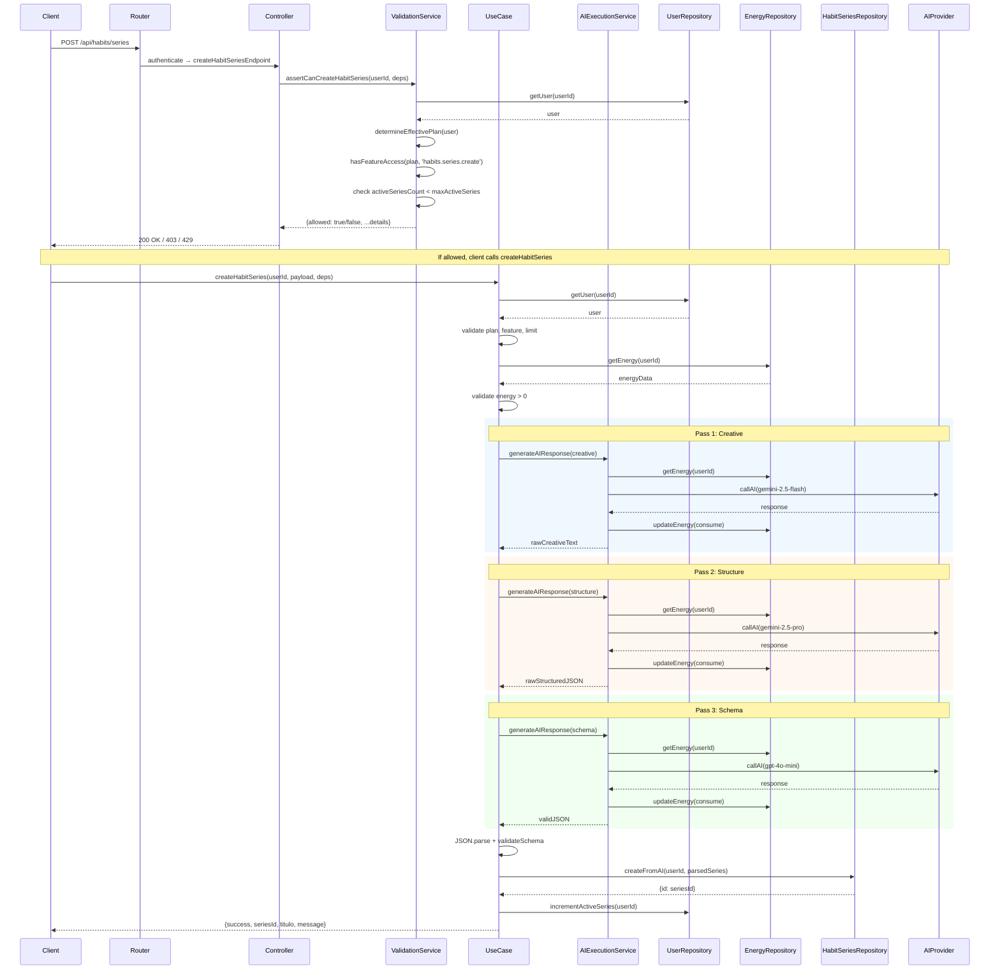

# Habit Series Creation Flow

Technical documentation for the habit series creation pipeline.

---

## 1. Overview

### Purpose

The habit series creation system generates personalized habit series using AI. A habit series consists of a title, description, and 3-5 actionable habits with progressive difficulty levels.

### High-Level Responsibility

Transform user test responses into a structured, AI-generated habit series that is validated against a strict schema before persistence.

---

## 2. Entry Point

### HTTP Endpoint

```
POST /api/habits/series
```

**Route Definition:** `infrastructure/http/routes/habitSeries.routes.js:33`

### Expected Input

The POST endpoint currently performs **validation only** (checking if the user CAN create a series). The actual creation is triggered separately.

**Validation Request Body:** Empty `{}`

**Creation Payload** (for `createHabitSeries` use case):

```javascript
{
  language: 'en' | 'es',
  assistantContext: string,          // Serialized assistant context
  testData: Record<string, string>,  // User test responses
  difficultyLabels: {
    low: string,
    medium: string,
    high: string
  }
}
```

### Authentication

- Firebase Authentication required via `authenticate` middleware
- User ID extracted from `req.user.uid` (Firebase Auth UID)

---

## 3. End-to-End Flow

The system operates in two distinct flows:

### Flow A: Pre-Creation Validation (Current POST /api/habits/series)

```
1. HTTP Request → authenticate middleware
2. Controller: createHabitSeriesEndpoint
3. Application Service: assertCanCreateHabitSeries
   3.1 Load user from Firestore
   3.2 Determine effective plan (freemium + active trial → trial)
   3.3 Check feature access: 'habits.series.create'
   3.4 Check active series limit against plan max
4. Return validation result (allowed: true/false)
```

### Flow B: Full Creation (CreateHabitSeriesUseCase)

```
1. PRE-AI VALIDATION
   1.1 Load user
   1.2 Determine effective plan
   1.3 Validate feature access
   1.4 Validate series limit
   1.5 Validate energy > 0

2. AI EXECUTION (3 passes)
   2.1 Creative Pass: Generate free-form text
   2.2 Structure Pass: Extract JSON structure
   2.3 Schema Pass: Enforce strict JSON schema

3. POST-AI VALIDATION
   3.1 Parse JSON response
   3.2 Validate against HABIT_SERIES_SCHEMA

4. PERSISTENCE
   4.1 Store in Firestore: users/{userId}/habitSeries/{seriesId}

5. SIDE EFFECTS
   5.1 Increment activeSeriesCount

6. RETURN SUCCESS
   6.1 Return {success, seriesId, titulo, message}
```

---

## 4. Responsibility Breakdown

### Controller

**File:** `infrastructure/http/controllers/HabitSeriesController.js`

| Function | Responsibility |
|----------|---------------|
| `createHabitSeriesEndpoint` | Extract userId, call validation service, map result to HTTP response |
| `deleteHabitSeriesEndpoint` | Extract userId and seriesId, call delete use case, map result |

The controller contains NO business logic. It performs:
- HTTP request parsing
- Error-to-HTTP-status mapping via `mapErrorToHttp`
- Logging

### Use Case

**File:** `application/use-cases/CreateHabitSeriesUseCase.js`

| Function | Responsibility |
|----------|---------------|
| `createHabitSeries` | Orchestrate full creation flow: validation → AI execution → validation → persistence → side effects |
| `determineEffectivePlan` | Map user plan + trial status to effective plan |
| `validateSchema` | Validate AI output against HABIT_SERIES_SCHEMA |

### Application Service

**File:** `application/services/habit_series/HabitSeriesValidationService.js`

| Function | Responsibility |
|----------|---------------|
| `assertCanCreateHabitSeries` | Pre-creation validation: user exists, feature access, series limit |

This is NOT a use case because it represents a precondition check, not a user intent.

**File:** `application/services/AIExecutionService.js`

| Function | Responsibility |
|----------|---------------|
| `generateAIResponse` | Execute AI call with energy validation and consumption |
| `generateAIResponseWithFunctionType` | Model selection + optional auto-persistence |

### Domain Policies

**File:** `domain/policies/PlanPolicy.js`

| Function | Responsibility |
|----------|---------------|
| `getPlan` | Get plan configuration, handle trial override |
| `hasFeatureAccess` | Check if plan has access to feature key |
| `tokensToEnergy` | Convert tokens to energy units |

**File:** `domain/policies/ModelSelectionPolicy.js`

| Function | Responsibility |
|----------|---------------|
| `getModelConfig` | Map function_type to model configuration |

### Repositories

**Port:** `domain/ports/IHabitSeriesRepository.js`

**Implementation:** `infrastructure/persistence/firestore/FirestoreHabitSeriesRepository.js`

| Method | Responsibility |
|--------|---------------|
| `createFromAI` | Persist series to Firestore, generate ID, add timestamps |
| `delete` | Remove series from Firestore |

---

## 5. Validation Strategy

### Pre-Condition Validations

**In CreateHabitSeriesUseCase (lines 129-185):**

| Check | Condition | Error Type |
|-------|-----------|------------|
| Dependencies | All required deps provided | `ValidationError` |
| Payload | language, testData, difficultyLabels present | `ValidationError` |
| User exists | User found in Firestore | `ValidationError('USER_NOT_FOUND')` |
| Feature access | Plan has 'habits.series.create' | `AuthorizationError` |
| Series limit | activeSeriesCount < maxActiveSeries | `AuthorizationError` |
| Energy | energyData.actual > 0 | `InsufficientEnergyError` |

### Post-Condition Validations

**After AI execution (lines 257-273):**

| Check | Condition | Error Type |
|-------|-----------|------------|
| JSON parseable | Response is valid JSON | `ValidationError` |
| Schema compliance | Matches HABIT_SERIES_SCHEMA | `ValidationError` |

### HABIT_SERIES_SCHEMA

```javascript
{
  type: 'object',
  required: ['titulo', 'descripcion', 'acciones'],
  properties: {
    titulo: { type: 'string' },
    descripcion: { type: 'string' },
    acciones: {
      type: 'array',
      minItems: 3,
      maxItems: 5,
      items: {
        type: 'object',
        required: ['nombre', 'descripcion', 'dificultad'],
        properties: {
          nombre: { type: 'string' },
          descripcion: { type: 'string' },
          dificultad: { type: 'string' }
        }
      }
    }
  }
}
```

### Failure Behavior

- Pre-condition failures: Operation aborts immediately, no AI calls made
- Post-condition failures: AI responses discarded, no persistence occurs
- All failures return appropriate error types for HTTP mapping

---

## 6. AI Interaction

### Role of AI in the System

AI generates personalized habit series content based on user test responses. The system uses a 3-pass strategy to ensure quality and schema compliance.

### Prompt Sequence

| Pass | Prompt File | Model | Temperature | Output |
|------|-------------|-------|-------------|--------|
| 1. Creative | `CreativeHabitSeriesPrompt.js` | gemini-2.5-flash | 0.8 | Free-form text |
| 2. Structure | `StructureHabitSeriesPrompt.js` | gemini-2.5-pro | 0.0 | JSON structure |
| 3. Schema | `JsonSchemaHabitSeriesPrompt.js` | gpt-4o-mini | 0.0 | Valid JSON |

### Pass 1: Creative Generation

**Purpose:** Generate human-readable, personalized content without structural constraints.

**Input:**
- Assistant context (conversation history)
- User test data
- Difficulty labels

**Output:** Text containing:
- 1 title
- Description (max 10 lines, ~120-180 words)
- 3-5 actions with name, description (max 5 lines), difficulty

**Rules enforced in prompt:**
- No intros ("Here is your series")
- No conclusions
- Only content, not JSON

### Pass 2: Structure Extraction

**Purpose:** Convert creative text into structured JSON.

**Input:** Raw text from Pass 1

**Output:**
```json
{
  "titulo": "",
  "descripcion": "",
  "acciones": [
    { "nombre": "", "descripcion": "", "dificultad": "" }
  ]
}
```

**Rules:**
- No markdown
- No explanations
- No text expansion or reduction

### Pass 3: Schema Enforcement

**Purpose:** Ensure strict JSON compliance against injected schema.

**Input:** JSON from Pass 2 + HABIT_SERIES_SCHEMA

**Output:** Valid JSON matching schema exactly

### Trust Boundaries

| Boundary | Trust Level | Validation |
|----------|-------------|------------|
| User input (testData) | Untrusted | Validated in payload check |
| AI output (all passes) | Untrusted | Parsed and validated against schema |
| Repository input | Trusted | Pre-validated by use case |

### Defensive Measures

1. **Schema validation:** All AI output validated before persistence
2. **Temperature control:** Schema pass uses 0.0 for deterministic output
3. **Model selection:** gpt-4o-mini with `forceJson: true` for final pass
4. **String trimming:** All fields validated as non-empty after trim

---

## 7. Persistence and Side Effects

### What is Persisted

**Habit Series Document:**

```javascript
{
  id: string,              // Generated: Date.now().toString() or provided
  titulo: string,
  descripcion: string,
  acciones: Array<{
    nombre: string,
    descripcion: string,
    dificultad: string
  }>,
  createdAt: Timestamp,    // Server timestamp
  updatedAt: Timestamp     // Server timestamp
}
```

**Path:** `users/{userId}/habitSeries/{seriesId}`

### When

Persistence occurs AFTER all validations pass:
1. Pre-AI validation passed
2. AI execution completed (3 passes)
3. Post-AI schema validation passed

### Why

Series are persisted only after full validation to ensure:
- No invalid data reaches Firestore
- No partial/incomplete series stored
- All business rules enforced before commitment

### Side Effects

| Effect | Location | Description |
|--------|----------|-------------|
| Increment activeSeriesCount | `userRepository.incrementActiveSeries` | User's limits.activeSeriesCount += 1 |
| Energy consumption | `energyRepository.updateEnergy` | Deduct energy for each AI call |
| Energy log | `energyRepository.updateEnergy` | Create log entry with action type |

**Energy Consumption Flow (per AI call):**
1. Check energy > 0 (pre-call)
2. Call AI provider
3. Calculate new energy: `actual - energyConsumed`
4. Update energy with action log: `AI_CALL_{model}`

---

## 8. Error Handling Model

### Domain Errors

**File:** `domain/domain_errors/`

| Error | Code | Description |
|-------|------|-------------|
| `InsufficientEnergyError` | `INSUFFICIENT_ENERGY` | User has insufficient energy for AI call |
| `TrialAlreadyUsedError` | `TRIAL_ALREADY_USED` | Trial already activated (not used in this flow) |

### Application Errors

**File:** `application/application_errors/`

| Error | Code | Description |
|-------|------|-------------|
| `ValidationError` | `VALIDATION_ERROR` | Invalid input, missing fields, schema mismatch |
| `AuthenticationError` | `AUTHENTICATION_ERROR` | User not authenticated |
| `AuthorizationError` | `AUTHORIZATION_ERROR` | User lacks permission |
| `NotFoundError` | `NOT_FOUND` | Resource not found |

### HTTP Error Mapping

**File:** `infrastructure/http/errorMapper.js`

| Error Code | HTTP Status |
|------------|-------------|
| `INSUFFICIENT_ENERGY` | 403 Forbidden |
| `TRIAL_ALREADY_USED` | 400 Bad Request |
| `VALIDATION_ERROR` | 400 Bad Request |
| `AUTHENTICATION_ERROR` | 401 Unauthorized |
| `AUTHORIZATION_ERROR` | 403 Forbidden |
| `NOT_FOUND` | 404 Not Found |
| Unexpected | 500 Internal Server Error |

### Validation Service Return Values

For `assertCanCreateHabitSeries`:

| Result | HTTP Status | Response |
|--------|-------------|----------|
| `allowed: true` | 200 OK | `{allowed, planId, limitType, used, max, remaining}` |
| `reason: 'USER_NOT_FOUND'` | 403 Forbidden | `{allowed: false, reason}` |
| `reason: 'FEATURE_NOT_ALLOWED'` | 403 Forbidden | `{allowed: false, reason, planId, featureKey}` |
| `reason: 'LIMIT_REACHED'` | 429 Too Many Requests | `{allowed: false, reason, limitType, used, max}` |

---

## 9. Flow Diagram



---

## 10. Key Invariants

### Business Rules

1. **Plan determines access:** Only `trial`, `mini`, `base`, `pro` plans can create series
2. **Series limit enforced:** `activeSeriesCount` must be < `maxActiveSeries` at creation time
3. **Energy required:** User must have `energy.actual > 0` before any AI call
4. **Schema compliance mandatory:** All persisted series match `HABIT_SERIES_SCHEMA`
5. **Actions bounded:** Every series contains exactly 3-5 actions

### Data Integrity

1. **Counter consistency:** `incrementActiveSeries` called IFF series successfully persisted
2. **Energy accounting:** Energy deducted after each successful AI call
3. **Timestamp accuracy:** Server timestamps used, not client timestamps
4. **ID uniqueness:** Series ID generated as `Date.now().toString()` or from data

### Concurrency

1. **No transaction wrapping:** Persistence and counter increment are separate operations
2. **Potential inconsistency:** If `incrementActiveSeries` fails after persistence, counter may be stale

---

## 11. Known Limitations and Accepted Debt

### Architectural

| Limitation | Impact | Status |
|------------|--------|--------|
| POST endpoint performs validation only, not creation | Client must make separate call to create | Intentional design |
| No transaction between persistence and counter increment | Potential counter drift | Accepted debt |
| Energy checked multiple times (use case + AIExecutionService) | Minor redundancy | Accepted for safety |

### AI Processing

| Limitation | Impact | Status |
|------------|--------|--------|
| 3-pass strategy consumes more energy | Higher cost per series | Accepted for quality |
| No retry logic on AI failures | Single failure aborts entire flow | Accepted debt |
| Language limited to 'en'/'es' | No support for other languages | Product scope |

### Validation

| Limitation | Impact | Status |
|------------|--------|--------|
| Schema validation is programmatic, not library-based | Manual validation code | Accepted |
| Difficulty values not enum-constrained | Free text from AI | Accepted |

### Data Model

| Limitation | Impact | Status |
|------------|--------|--------|
| Series ID based on timestamp | Potential collision in sub-millisecond creates | Low probability, accepted |
| No soft delete | Series permanently removed | Intentional design |

---

## File Reference Index

| Component | File Path |
|-----------|-----------|
| Route | `infrastructure/http/routes/habitSeries.routes.js` |
| Controller | `infrastructure/http/controllers/HabitSeriesController.js` |
| Use Case | `application/use-cases/CreateHabitSeriesUseCase.js` |
| Validation Service | `application/services/habit_series/HabitSeriesValidationService.js` |
| AI Execution Service | `application/services/AIExecutionService.js` |
| Creative Prompt | `application/prompts/habit_series/CreativeHabitSeriesPrompt.js` |
| Structure Prompt | `application/prompts/habit_series/StructureHabitSeriesPrompt.js` |
| Schema Prompt | `application/prompts/habit_series/JsonSchemaHabitSeriesPrompt.js` |
| Plan Policy | `domain/policies/PlanPolicy.js` |
| Model Selection Policy | `domain/policies/ModelSelectionPolicy.js` |
| Habit Series Repository | `infrastructure/persistence/firestore/FirestoreHabitSeriesRepository.js` |
| Error Mapper | `infrastructure/http/errorMapper.js` |
